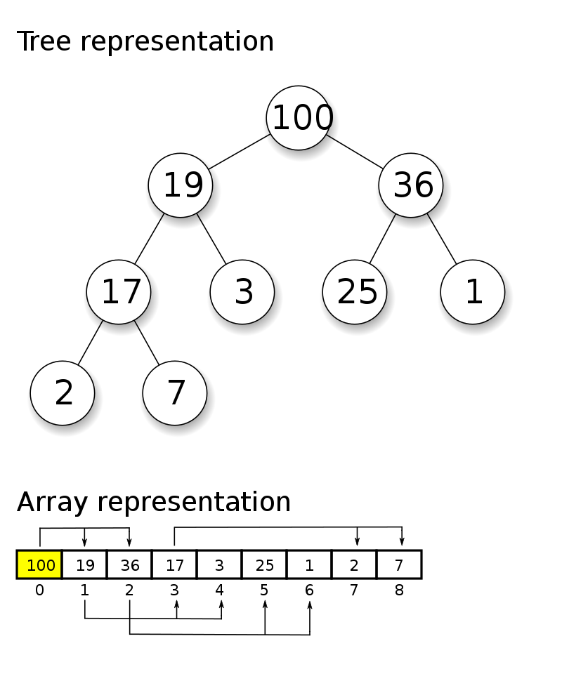

**[*chinese version*](README_CN.md)**

---


# Table of Contents

- [1. Linear data structures and nonlinear data structures](#1-linear-data-structures-and-nonlinear-data-structures)
    * [1.1 Linear data structures](#11-linear-data-structures)
    * [1.2 non-linear data structures](#12-non-linear-data-structures)
- [2. Sparse Array and Queue](#2-sparse-array-and-queue)
    * [2.1 Sparse Array](#21-sparse-array)
      + [2.1.1 Description of Sparse Array](#211-description-of-sparse-array)
      + [2.1.2 Conversion between two-dimensional array and sparse array](#212-conversion-between-two-dimensional-array-and-sparse-array)
         - [Approach two-dimensional array to sparse array](#approach-two-dimensional-array-to-sparse-array)
         - [Approach sparse array to 2-dimensional array](#approach-sparse-array-to-2-dimensional-array)
      + [2.1.3 Code](#213-code)
   * [2.2 Queue](#22-queue)
      + [2.2.1 Description of Queue](#221-description-of-queue)
      + [2.2.2 Queues based on Arrays](#222-queues-based-on-arrays)
      + [2.2.3 Code](#223-code)
      + [2.2.4 Circular Queues based on Arrays](#224-circular-queues-based-on-arrays)
         - [Approach](#approach)
      + [2.2.5 Code](#225-code)
- [3. Linked List](#3-linked-list)
   * [3.1 Singly Linked list](#31-singly-linked-list)
      + [3.1.1 Description of Singly Linked list](#311-description-of-singly-linked-list)
      + [3.1.2 Creation of a singly linked list](#312-creation-of-a-singly-linked-list)
      + [3.1.3 Insertion of an element to the singly linked list](#313-insertion-of-an-element-to-the-singly-linked-list)
      + [3.1.4 Modification of an element in the singly linked lsit](#314-modification-of-an-element-in-the-singly-linked-lsit)
      + [3.1.5 Deletion of an element from the singly linked list](#315-deletion-of-an-element-from-the-singly-linked-list)
      + [3.1.6 Code](#316-code)
   * [3.2 Doubly Linked List](#32-doubly-linked-list)
      + [3.2.1 Description of Doubly Linked List](#321-description-of-doubly-linked-list)
      + [3.2.2 CRUD of doubly linked list](#322-crud-of-doubly-linked-list)
      + [3.2.3 Code](#323-code)
   * [3.3 Circular singly linked list](#33-circular-singly-linked-list)
      + [3.3.1 Application of circular singly linked list: Josephus Problem](#331-application-of-circular-singly-linked-list--josephus-problem)
      + [3.3.2 Creation and Operation of circular singly linked list](#332-creation-and-operation-of-circular-singly-linked-list)
      + [3.3.3 Code](#333-code)
- [4. Stack](#4-stack)
   * [4.1 Description of Stack](#41-description-of-stack)
   * [4.2 Application of stack](#42-application-of-stack)
   * [4.3 Stack based on Array](#43-stack-based-on-array)
   * [4.4 Stack based Calculator](#44-stack-based-calculator)
   * [4.5 Prefix, Infix and Postfix Expressions](#45-prefix--infix-and-postfix-expressions)
      + [4.5.1 Prefix Expression](#451-prefix-expression)
      + [4.5.2. Infix Expression](#452-infix-expression)
      + [4.5.3. Postfix Expression](#453-postfix-expression)
      + [4.5.4. Postfix Expression Calculator:](#454-postfix-expression-calculator-)
      + [4.5.5. Conversion of Infix Expression to Postfix Expression](#455-conversion-of-infix-expression-to-postfix-expression)
- [5. Recursion](#5-recursion)
   * [5.1 Description of Recursion](#51-description-of-recursion)
   * [5.2 Recursion Mechanism](#52-recursion-mechanism)
   * [5.3 Recursion: Maze](#53-recursion--maze)
   * [5.4 Recursion: Eight Queens Problem（Backtracking）](#54-recursion--eight-queens-problem-backtracking-)
      + [5.4.1 Description of eight queens problem](#541-description-of-eight-queens-problem)
      + [5.4.2 Eight queens problem analysis](#542-eight-queens-problem-analysis)
      + [5.4.3 Code](#543-code)
- [6. Sorting Algorithms](#6-sorting-algorithms)
   * [6.1 Description of Sorting Algorithms](#61-description-of-sorting-algorithms)
   * [6.2 Classification of Sorting Algorithms:](#62-classification-of-sorting-algorithms-)
   * [6.3 Time Complexity](#63-time-complexity)
      + [6.3.1 Time Complexity T(n)](#631-time-complexity-t-n-)
         - [Examples:](#examples-)
      + [6.3.2  Big-O notation](#632--big-o-notation)
      + [6.3.3 average case and worst case scenarios](#633-average-case-and-worst-case-scenarios)
      + [6.3.4 Space complexity](#634-space-complexity)
   * [6.4 Bubble Sort](#64-bubble-sort)
      + [6.4.1 Description of Bubble Sort](#641-description-of-bubble-sort)
      + [6.4.2 Code](#642-code)
   * [6.5 Selection Sort](#65-selection-sort)
      + [6.5.1 Description of Selection Sort](#651-description-of-selection-sort)
      + [6.5.2 Code](#652-code)
   * [6.6 Insertion Sort](#66-insertion-sort)
      + [6.6.1 Description of Insertion Sort](#661-description-of-insertion-sort)
      + [6.6.2 Code](#662-code)
   * [6.7 Shell Sort](#67-shell-sort)
      + [6.7.1 Description of Shell Sort](#671-description-of-shell-sort)
      + [6.7.2 Code](#672-code)
   * [6.8 Quick Sort](#68-quick-sort)
      + [6.8.1 Description of Quick Sort](#681-description-of-quick-sort)
      + [6.8.2 Code](#682-code)
   * [6.9 Merge Sort](#69-merge-sort)
      + [6.9.1 Description of Quick Sort](#691-description-of-quick-sort)
      + [6.9.2 Code](#692-code)
   * [6.10 Radix Sort](#610-radix-sort)
      + [6.10.1 Description of Radix Sort](#6101-description-of-radix-sort)
      + [6.10.2 Code](#6102-code)
   * [6.11 Time Complexities Cheat Sheet](#611-time-complexities-cheat-sheet)
- [7. Searching Algorithms](#7-searching-algorithms)
   * [7.1 linear Search](#71-linear-search)
      + [7.1.1 Description of linear Search](#711-description-of-linear-search)
      + [7.1.2 Code](#712-code)
   * [7.2 Binary Search](#72-binary-search)
      + [7.2.1 Description of Binary Search](#721-description-of-binary-search)
      + [7.2.2 Code](#722-code)
- [8. Hash Table](#8-hash-table)
   * [8.1 Description of Hash Table](#81-description-of-hash-table)
      + [8.1.1 Hashing](#811-hashing)
      + [8.1.2 Hash Table](#812-hash-table)
   * [8.2 Code](#82-code)
- [9. Tree](#9-tree)
   * [9.1 Binary tree](#91-binary-tree)
      + [9.1.1 Analysis of array storage](#911-analysis-of-array-storage)
      + [9.1.2 Analysis of linked list storage](#912-analysis-of-linked-list-storage)
      + [9.1.3 Analysis of tree storage](#913-analysis-of-tree-storage)
   * [9.2 Components and Terminologies](#92-components-and-terminologies)
   * [9.3 Pre-Order, In-Order and Post-Order Traversal in Binary Trees](#93-pre-order--in-order-and-post-order-traversal-in-binary-trees)
   * [9.4 Pre-Order, In-Order and Post-Order Search in Binary Trees](#94-pre-order--in-order-and-post-order-search-in-binary-trees)
   * [9.5 Deletion](#95-deletion)
      + [9.5.1 Requirements](#951-requirements)
      + [9.5.1 Approach](#951-approach)
   * [9.6 Code](#96-code)
- [10. Heap](#10-heap)
    * [10.1 Description of Heap](#101-description-of-heap)
        + [10.1.1 Heap](#1011-heap)
        + [10.1.2 Array based Heap](#1012-array-based-heap)
    * [10.2 Applications of Heap](#102-applications-of-heap)
    * [10.3 Approach of Heap Sort](#103-approach-of-heap-sort)
    * [10.4 Code](#104-code)

---

# 1. Linear data structures and nonlinear data structures

[Source: Techvidvan](https://techvidvan.com/tutorials/data-structure-in-java/)

The term data structure refers to a data collection with well-defined operations and behavior or properties. A data
structure is a unique way of **storing or organizing the data in computer memory** so that we can use it effectively.


## 1.1 Linear data structures

1. Linear structures, as the most commonly used data structures, are characterized by a **one-to-one** linear
   relationship between data elements.
2. Linear structures have two different storage structures, namely **sequential storage structure** and **chain storage
   structure**.
3. A linear table with sequential storage is called a **sequence table**, its characteristic is that **the logically
   adjacent data elements are also adjacent in physical order**.
4. A linear table with chained storage is called a **linked list**, where the stored elements are not necessarily
   physically adjacent and the element nodes hold the data elements and the address information of the adjacent
   elements.
5. There are four types of linear data structures: **array**, **queue**, **linked list** and **stack**

## 1.2 non-linear data structures

The non-linear data structure **does not arrange the data in a sequential manner** as in linear data structures.
Non-linear data structures are the multilevel data structure.

Non-linear structures include: **two-dimensional array**, **multi-dimensional array**, **generalized list**, **tree**
and **graph**.

# 2. Sparse Array and Queue

## 2.1 Sparse Array

### 2.1.1 Description of Sparse Array

[Source: techopedia](https://www.techopedia.com/definition/9480/sparse-array#:~:text=A%20sparse%20array%20is%20an,array%20in%20digital%20data%20handling.)

A sparse array is an array of data in which many elements have a value of zero. This is in contrast to a dense array,
where most of the elements have non-zero values or are “full” of numbers. A sparse array may be treated differently than
a dense array in digital data handling.。

How to handle sparse arrays:

1. record the number of rows and columns of the array and the number of different values .
2. Record the row and column of the elements with different values in a small array, thus reducing the size of the
   program.

### 2.1.2 Conversion between two-dimensional array and sparse array

#### Approach two-dimensional array to sparse array

1. Iterate through the original 2-dimensional array to get the number of non-zero data `sum` .
2. Create the sparse array `SparseArr int[sum+1][3]` based on `sum` .
3. Store the non-zero data of the two-dimensional array into the sparse array .

#### Approach sparse array to 2-dimensional array

1. Create the original 2-dimensional array based on the first row of sparse array.
2. Continue to read the next rows of the sparse array and recover the original 2D array.

### 2.1.3 Code

[Conversion between two-dimensional array and sparse array](src/com/yijie/sparsearray/SparseArray.java)

## 2.2 Queue

### 2.2.1 Description of Queue

[Source: Techvidvan](https://techvidvan.com/tutorials/data-structure-in-java/)

Logically, a queue is a **FIFO (First In First Out)** data structure and we can physically implement it **either as an
array or a linked list**. Whatever way we use to implement a queue, **insertions always take place at the “rear” end and
deletions always from the “front” end of the queue**.

### 2.2.2 Queues based on Arrays

1. In queues which are based on arrays , the `maxSize` is the maximum capacity of the queue .
2. Since the output and input of the queue are handled from the front and back respectively, two pointers `front`
   and `rear` are needed to record the index of the front and back respectively,
   `front` will change with the data output and `rear` will change with the data input.
3. The process to put data into a queue is called `addQueue`, and the processing of `addQueue` requires two steps:

- Move the rear pointer backwards, `rear+1`; when `front=rear`, the queue is empty
- If the rear pointer `rear` is smaller than the maximum index of the queue `maxSize-1`, deposit the data in the
  position pointed by `rear`, otherwise it cannot be deposited. If `rear == maxSize-1`, the queue is full.


### 2.2.3 Code

[Queues based on Arrays](src/com/yijie/queue/ArrayQueueDemo.java)

### 2.2.4 Circular Queues based on Arrays

[Source: programiz](https://www.programiz.com/dsa/circular-queue)

A circular queue is the extended version of a regular queue where the last element is connected to the first element.
Thus forming a circle-like structure.

- The circular queue solves the major limitation of the normal queue. In a normal queue, after a bit of insertion and
  deletion, there will be non-usable empty space.
- the circular increment is performed by **modulo division** with the queue size.

#### Approach

1. Adjust the meaning of the `front` pointer: `front` tracks the first element of the queue, that is, `arr[front]` is
   the first element of the queue, and the initial value of `front` is 0.
2. Adjust the meaning of the `rear` pointer: `rear` tracks the next position of the last element in the queue, and the
   initial value of `rear` is 0.
3. The queue is full when `(rear + 1) % maxSize = front`
4. The queue is empty when `rear = front`
5. the number of valid data in the queue `(rear + maxSize - front) % maxSize`

### 2.2.5 Code

[Circular Queues based on Arrays](src/com/yijie/queue/CircleArrayQueueDemo.java)

# 3. Linked List

## 3.1 Singly Linked list

### 3.1.1 Description of Singly Linked list

[Source: Wikipedia](https://en.wikipedia.org/wiki/Linked_list)

In computer science, a linked list is a linear collection of data elements **whose order is not given by their physical
placement in memory**. Instead, each element points to the next.


1. Linked list is a data structure consisting of a collection of nodes
2. Each node contains **data** and **next** (a reference filed to the next node in the sequence)
3. The nodes of a linked list are not necessarily stored consecutively
4. there is a linked list **with a head node** and a linked list **without a head node**

### 3.1.2 Creation of a singly linked list

1. Create a `head` node as the head of the linked list
2. Add the subsequent nodes in sequence to the list

### 3.1.3 Insertion of an element to the singly linked list

1. Find the position of the element to be inserted through **traversal** and **auxiliary variable `temp`**.
2. `newNode.next = temp.next`
3. `temp.next = newNode`

### 3.1.4 Modification of an element in the singly linked lsit

1. Find the node by traversal
2. Modify the node information

### 3.1.5 Deletion of an element from the singly linked list

1. Find **the previous node** `temp` of the node to be deleted
2. `temp.next = temp.next.next`
3. The deleted node isn't referenced any more and will be recycled by the garbage collection mechanism

*The time complexity of deleting a node will be **O(N)**, because we have to traverse the linked list from the head node
to find out the previous node `temp`.*

*The space complexity is **O(1)** because we only need constant space to store our pointers.*

### 3.1.6 Code

[Singly Linked list](src/com/yijie/linkedlist/SingleLinkedListDemo.java)

## 3.2 Doubly Linked List

### 3.2.1 Description of Doubly Linked List

Pros of Doubly Linked List:

1. Singly linked list can only be traversed in one direction, doubly linked lists can be traversed either forwards or backwards
2. Elements are deleted from single-linked list relying on an **auxiliary pointer**, elements in doubly linked list can be **self-deleted**.
3. Comparison of Time Complexity between linked lists and Array


[Source: LeetCode](https://leetcode.com/explore/learn/card/linked-list/213/conclusion/1230/)

### 3.2.2 CRUD of doubly linked list

1. Traversal is the same as for a singly linked list, difference: **bidirectional**
2. **Add**: Add to the end of the list by default
   1. move to the last node of the doubly linked list
   2. `temp.next = newHeroNode`
   3. `newHeroNode.pre = temp`
3. **Modify**: same as in singly linked list
4. **Deletion**:
    1. doubly linked lists can be self-deleted
    2. locate the node `temp` which should be deleted
    3. `temp.pre.next = temp.next`
    4. `temp.next.pre = temp.pre`

### 3.2.3 Code

[Doubly Linked List](src/com/yijie/linkedlist/DoubleLinkedListDemo.java)

## 3.3 Circular singly linked list

### 3.3.1 Application of circular singly linked list: Josephus Problem

[Source: Wikipedia](https://en.wikipedia.org/wiki/Josephus_problem)

In computer science and mathematics, the Josephus problem (or Josephus permutation) is a theoretical problem related to
a certain counting-out game.

People are standing in a circle waiting to be executed. Counting begins at a specified point in the circle and proceeds
around the circle in a specified direction. After a specified number of people are skipped, the next person is executed.
The procedure is repeated with the remaining people, starting with the next person, going in the same direction and
skipping the same number of people, until only one person remains, and is freed.


**Example**:

* n=5, 5 people sitting in a circle
* k=1, counting begins from the first person
* m=2, the person who calls 2 is out
* counting-out sequence:
    * 2=>4=>1=>5=>3

### 3.3.2 Creation and Operation of circular singly linked list

1. **Creation** of a circular singly linked list
   1. Create the first node, let the first pointer point to this node, and form a ring
   2. For each new node created, add the node to the existing ring
2. **Traversal**of circular singly linked list
   1. Let the auxiliary pointer track the first node
   2. Traversal with the helf of the while loop (`cur.next == first`)

### 3.3.3 Code

[Circular Singly Linked List and Josephus Problem](src/com/yijie/linkedlist/JosephuProblem.java)

# 4. Stack

## 4.1 Description of Stack

1. Stack is a abstract data type which takes the last in first out (LIFO) ordering
2. A stack restricts the insertion and deletion of elements ** to the same end**. 
The side that allows insertion and deletion is called the **Top**, and the fixed side is called the **Bottom**.
3. The entire functionality of a stack depends on the **push** and **pop** methods.


## 4.2 Application of stack

1. Processing Function Calls
2. To backtrack to the previous task/state, e.g., in a **recursive code**
3. Expression Evaluation Algorithm: Calculators employing reverse Polish notation use a stack structure to hold values.
4. Traversal of the binary trees
5. Depth First Search

## 4.3 Stack based on Array

1. Define a `top` to represent the top of the stack, initialized to -1
2. Push: `top++`;`stack[top] = data`
3. Pop: `int value = stack[top]`; `top--`; `return value`
4. [Code](src/com/yijie/stack/ArrayStackDemo.java)

## 4.4 Stack based Calculator

1. Traverse the expression using an auxiliary pointer `index`
2. If **number**, push to number stack
3. If **operator**:
   - if the operator stack is empty, push the operator to the stack
   - if the operator stack is not empty, compared the new operator with the operator at the top of the operator stack.
     **If the priority of the current operator is less than or equal to the operator in the stack**, pop two numbers from
     the number stack and one operator from the operator stack and calculate. push the obtained result into the number
     stack and the current operator is into the operator stack afterwards. **If the priority of the current operator is greater than the operator in the stack**, it is directly pushed into the
     operator stack.
4. When the expression is scanned, the corresponding number and operator are popped from the number stack and the operator stack in sequence, and run.
5. The number left in the number stack at last is the final result
6. Code: [Stack based Calculator](src/com/yijie/stack/Calculator.java)

## 4.5 Prefix, Infix and Postfix Expressions

### 4.5.1 Prefix Expression

* In this notation, operator is prefixed to operands, i.e. **operator is written ahead of operands**.
* Prefix notation is also known as **Polish Notation**.
* Example: `(3 + 4) \ * 5 - 6` => `- * + 3 4 5 6`
* **Evaluation of Prefix Expression**:

[Source: geeksforgeeks](https://www.geeksforgeeks.org/evaluation-prefix-expressions/)

  1. Put a pointer P at the end of the expression
  2. If character at P is an operand push it to Stack
  3. If the character at P is an operator pop two
    elements from the Stack. Operate on these elements
    according to the operator, and push the result
    back to the Stack
  4. Decrement P by 1 and go to Step 2 as long as there
    are characters left to be scanned in the expression.
  5. The Result is stored at the top of the Stack,
    return it
  6. End


### 4.5.2. Infix Expression

* Operators are written in-between their operands. This is the usual way we write expressions.like: `(3 + 4 ) * 5 - 6`

### 4.5.3. Postfix Expression

* Operators are written after their operands, also called Reverse Polish Notation
* Example: `(3 + 4 ) \ * 5 - 6` => `3 4 + 5 \ * 6 -`
* **Evaluation of Postfix Expression**:

  just like the evaluation of prefix expression , but the order of evaluation of operators is always **left-to-right**

* Example:

|   infix   | postfix |   
|:---------:|:-------:|  
|    a+b    |   ab+   |  
|  a+(b-c)  |  abc-+  |  
| a+(b-c)*d | abc-d*+ |  
| a+d*(b-c) | adbc-*+ |  
|   a=1+3   |  a13+=  |

### 4.5.4. Postfix Expression Calculator:

Code: [Postfix Expression Calculator](src/com/yijie/stack/ReversePolishNotation.java)

### 4.5.5. Conversion of Infix Expression to Postfix Expression

 1. initialize two stacks, the operator stack `s1` and the stack `s2` that stores intermediate results
 2. scan the index expression from left to right
 3. push the operand into `s2` when it is encountered
 4. When an operator is encountered, compare its priority level with the top-of-stack operator `s1`
     1. If `s1` is empty, or the top-of-stack operator is a left bracket "(", then the operator is directly pushed to the stack;
     2. if the priority is higher than the stack top operator, push the operator into `s1` as well
     3. if the priority is not higher than the top of stack operator, pop `s1` top of stack operator and push it into `s2`, repeat the above comparison
 5. When brackets are encountered:
     1. if "(" push to `s1`
     2. if ")", pop `s1` top-of-stack operator and push it into `s2` until a left bracket is encountered, then discard the brackets
 6. Repeat steps 2-5 until the rightmost end of the expression.
 7. pop the remaining operators of `s1` in turn and push into `s2`
 8. Pop out the elements of `s2` in sequence, the **inverse order of the result is the postfix expression**

**Code**: [Conversion of Infix Expression to Postfix Expression](src/com/yijie/stack/ReversePolishNotation.java)

# 5. Recursion

## 5.1 Description of Recursion

Recursion is one of the most important concepts in computer science. Simply speaking, recursion is the process of a
function calling itself. 

In mathematics and computer science, a class of objects or methods exhibits recursive behavior
when it can be defined by two properties:

* **A simple base case (or cases)** — a terminating scenario that does not use recursion to produce an answer 
* **A recursive step** — a set of rules that reduces all successive cases toward the base case.

## 5.2 Recursion Mechanism

1. When a program executes a method, a separate space is opened. (**stack**)
2. the data (local variables) in each space are independent and do not affect each other
3. If a non-primitive data type (e.g. array) is used in a method, the data of that reference type is shared.
4. **recursion must approach the exit condition**, otherwise it will be infinitely recursive and `StackOverFlowError`
   will occur
5. When a method finishes executing, or encounters `return`, it returns, following the principle of who calls the result
   back to whom. Also, when the method finishes executing or returns, the method also finishes executing.

## 5.3 Recursion: Maze


Code: [Maze](src/com/yijie/recursion/Maze.java)

## 5.4 Recursion: Eight Queens Problem（Backtracking）

### 5.4.1 Description of eight queens problem

[Source: Wikipedia](https://en.wikipedia.org/wiki/Eight_queens_puzzle)

The eight queens puzzle is the problem of placing eight chess queens on an 8×8 chessboard so that no two queens threaten each other; thus, a solution requires that no two queens share the same row, column, or diagonal. There are 92 solutions. The problem was first posed in the mid-19th century. In the modern era, it is often used as an example problem for various computer programming techniques.

### 5.4.2 Eight queens problem analysis

1. The first queen is placed in the first column of the first row
2. The second queen is placed in the first column of the second row, determine whether the requirements are met. If not,
   continue to put the second queen in the second column of the second row, the third column... Until the second queen
   is in the eligible position.
3. Place the third queen in the first column of the third row, the second column... Then determine if the condition is
   met, until it is in the eligible position. Repeat the same steps until the eighth queen is in the correct position.
4. When the first correct solution is obtained, backtracking starts when the stack is backed up to the previous stack.
   That is, get all correct solutions when the first queen is in the first column.
5. placing the first queen in the second column of the first row, repeat steps 1 to 4.

### 5.4.3 Code

[Eight Queens Problem](src/com/yijie/recursion/EightQueens.java)

# 6. Sorting Algorithms

## 6.1 Description of Sorting Algorithms

Sorting is the process of arranging items systematically. 
In computer science, sorting algorithms put elements of a list **in a specific order**.

## 6.2 Classification of Sorting Algorithms:

* Internal Sorting: Sorting algorithms that use **main memory exclusively** during the sort are called internal sorting algorithms.
* External Sorting: Sorting algorithms that use **external memory** during the sort

## 6.3 Time Complexity

Time complexity measures the time taken to execute each statement of code in an algorithm.

1. Post-hoc statistical approach: This approach is feasible, but faces two problems:
   * the need to actually run the program
   * The time statistics obtained depends on the computer hardware, software and other environmental factors.
2. ex ante estimation method: the algorithm's time complexity is calculated to evaluate the algorithms

### 6.3.1 Time Complexity T(n)

The time required for an algorithm is directly related to the number of statements executed in the algorithm. 
The more statements are executed in an algorithm, the more time it takes. The number of times a statement is executed in an algorithm is called Time Complexity and is denoted as T(n).

#### Examples:

Calculate the sum of 1 to 100:

* for loop，T(n) = n + 1:

```java
        int total=0;
        int end=100;

        for(i=0;i<end; i++){
        total+=i;
        }
```

* direct calculation，T(n) = 1:

```java
        int total=0;
        int end=100;
        total=(1+end)*end/2
```

3 characteristics:

* constant terms can be ignored
* low order terms can be ignored
* hihher order coefficients can be ignored

### 6.3.2  Big-O notation

1. In general, the time complexity of an algorithm is a function of the input size n, denoted by T(n). If there is some
   auxiliary function f(n) such that n tends to infinity, the limit of T(n)/f(n) is a constant not equal to zero,
   denoted as **T(n)=O(f(n))**, O(f(n)) is the **asymptotic time complexity** of the algorithm, abbreviated as time
   complexity.
2. T(n) can be different, but the time complexity may be the same.
3. The method to calculate the time complexity:
   * **Replace all constants with the constant 1**
   * **Keep only the highest order term**
   * **Remove the coefficients of the highest order term**
4. The common time complexity, from smallest to largest, is listed below. As n increases, the execution efficiency of
   the algorithm decreases as the time complexity increases.
   1. Constant Time Complexity O(1)
   2. Logarithmic Time Complexity O(log2n)
   3. Linear Time Complexity O(n)
   4. Linear Logarithmic Time Complexity O(nlog2n)
   5. Quadratic Time Complexity O(n^2)
   6. Cubic Time Complexity O(n^3)
   7. K-th Order Time ComplexityO(n^k)
   8. Exponential Time Complexity O(2^n)

### 6.3.3 average case and worst case scenarios

1. **Average case scenario** is the running time of the algorithm with **equal probability of occurrence for all input
   instances**.
2. **Worst case analysis** gives the maximum number of basic operations that have to be performed during execution of
   the algorithm. It assumes that the input is in the worst possible state and maximum work has to be done to put things
   right.
3. Whether the average time complexity is consistent with the worst-case time complexity depends on the algorithm.

### 6.3.4 Space complexity

[Source: Wikipedia](https://en.wikipedia.org/wiki/Space_complexity)

1. The space complexity of an algorithm or a computer program is the amount of memory space required to solve an
   instance of the computational problem as a function of characteristics of the input.
2. Similar to time complexity, space complexity is often expressed asymptotically in big O notation, such as O(n), O(
   nlog n), O(2^n), etc., **where n is a characteristic of the input** influencing space complexity.
3. When doing algorithm analysis, the essential discussion is time complexity. **From a user experience perspective, it
   is more about the speed of program execution**. Some caching products (redis, memcache) and algorithms (radix
   sorting) is the traditional exchange of space for time.

## 6.4 Bubble Sort

### 6.4.1 Description of Bubble Sort

[Source: Wikipedia](https://en.wikipedia.org/wiki/Bubble_sort)

Bubble sort, sometimes referred to as sinking sort, is a simple sorting algorithm that repeatedly steps through the list, 
compares adjacent elements and swaps them if they are in the wrong order. The pass through the list is repeated until the list is sorted. 
The algorithm, which is a comparison sort, is named for the way smaller or larger elements "bubble" to the top of the list.

* **Optimization**: an optimization algorithm for bubble sort is to set a flag that indicates that the sequence is ordered 
when no exchange of elements occurs during a traverse to the end.

### 6.4.2 Code

[Bubble Sort](src/com/yijie/sort/BubbleSort.java)

## 6.5 Selection Sort

### 6.5.1 Description of Selection Sort

The algorithm divides the input list into two parts: **a sorted sublist of items** at the front (left) of the list 
and **a sublist of the remaining unsorted items** at the right of the list. 
Initially, the sorted sublist is empty and the unsorted sublist is the entire input list. 
The algorithm proceeds by finding the smallest element in the unsorted sublist, swapping it with the leftmost unsorted element, 
and moving the sublist boundaries one element to the right.


### 6.5.2 Code

[Selection Sort](src/com/yijie/sort/SelectionSort.java)

## 6.6 Insertion Sort

### 6.6.1 Description of Insertion Sort

Insertion sort is a simple sorting algorithm that works similar to the way you sort playing cards in your hands. 
The array is virtually split into **a sorted and an unsorted part**. 
Values from the unsorted part are picked and placed at the correct position in the sorted part.


### 6.6.2 Code

[Insertion Sort](src/com/yijie/sort/InsertionSort.java)

## 6.7 Shell Sort

### 6.7.1 Description of Shell Sort

[Source: Wikipedia](https://en.wikipedia.org/wiki/Shellsort)

Shell sort is an in-place comparison sort. It can be seen as either **a generalization of sorting by exchange (bubble sort)** or **sorting by insertion (insertion sort)**. 
The method starts by sorting pairs of elements far apart from each other, then progressively reducing the gap between elements to be compared. 
By starting with far apart elements, it can move some out-of-place elements into position faster than a simple nearest neighbor exchange. 
Donald Shell published the first version of this sort in 1959. The running time of Shellsort is heavily dependent on the gap sequence it uses. 
For many practical variants, determining their time complexity remains an open problem.

### 6.7.2 Code

[Shell Sort](src/com/yijie/sort/ShellSort.java)

## 6.8 Quick Sort

### 6.8.1 Description of Quick Sort

[Source: Wikipedia](https://en.wikipedia.org/wiki/Quicksort)

Quicksort is a **divide-and-conquer algorithm**. 
It works by selecting a 'pivot' element from the array and partitioning the other elements into two sub-arrays, 
according to whether they are less than or greater than the pivot. 
For this reason, it is sometimes called **partition-exchange sort**. 
The sub-arrays are then sorted recursively. 
This can be done in-place, requiring small additional amounts of memory to perform the sorting.


### 6.8.2 Code

[Quick Sort](src/com/yijie/sort/QuickSort.java)

## 6.9 Merge Sort

### 6.9.1 Description of Quick Sort

[Source: Wikipedia](https://en.wikipedia.org/wiki/Merge_sort)

Conceptually, a merge sort works as follows:

* Divide the unsorted list into n sublists, each containing one element (a list of one element is considered sorted).
* Repeatedly merge sublists to produce new sorted sublists until there is only one sublist remaining. This will be the
  sorted list.


### 6.9.2 Code

[Merge Sort](src/com/yijie/sort/MergeSort.java)

## 6.10 Radix Sort

### 6.10.1 Description of Radix Sort

[Source: Wikipedia](https://en.wikipedia.org/wiki/Radix_sort)

1. In computer science, radix sort is a **non-comparative sorting algorithm**. It avoids comparison by creating and
   distributing elements into buckets according to their radix.
2. For elements with more than one significant digit, this bucketing process is repeated for each digit, while
   preserving the ordering of the prior step, until all digits have been considered.
3. radix sort has also been called bucket sort and digital sort.


### 6.10.2 Code

[Radix Sort](src/com/yijie/sort/RadixSort.java)

## 6.11 Time Complexities Cheat Sheet

[Source: Wikipedia](https://en.wikipedia.org/wiki/Radix_sort)


# 7. Searching Algorithms

## 7.1 linear Search

### 7.1.1 Description of linear Search

[Source: Wikipedia](https://en.wikipedia.org/wiki/Linear_search)

A linear search or sequential search is a method for finding an element within a list. It sequentially checks each
element of the list until a match is found or the whole list has been searched.

### 7.1.2 Code

[linear search](src/com/yijie/search/LinearSearch.java)

## 7.2 Binary Search

### 7.2.1 Description of Binary Search

**Prerequisite: the elements in the Array are in *sorted order*.**
The binary search approach:

1. First determine the index of the middle value of the array: `mid = (left + right) / 2`
2. compare the value to be found `findVal` with `arr[mid]`
    * `findVal > arr[mid]` recursion to the right
    * `findVal < arr[mid]` recursion to the left
    * `findVal == arr[mid]` value found, return
3. after the recursion for the whole array, if `findVal` is still not found, end (`left > right`)

### 7.2.2 Code

[binary search](src/com/yijie/search/BinarySearch.java)

# 8. Hash Table

## 8.1 Description of Hash Table

[Source: Wikipedia](https://en.wikipedia.org/wiki/Hash_table)

In computing, a hash table (hash map) is a data structure that implements an associative array abstract data type, a
structure that can map keys to values. A hash table uses a hash function to compute an index, also called a hash code,
into an array of buckets or slots, from which the desired value can be found. During lookup, the key is hashed and the
resulting hash indicates where the corresponding value is stored.

### 8.1.1 Hashing

[Source: Educative](https://www.educative.io/courses/data-structures-coding-interviews-java/q2pWP84GWmG)

Hashing is a process used to uniquely identify objects and store each object at some pre-calculated unique index called
its key. So the object is stored in the form of **a key-value pair**, and the collection of such items is called
“Dictionary”. Each object can be searched using that key in **O(1)**.

### 8.1.2 Hash Table

The major target of Hash Tables is to minimize the searching time of any sort of data that needs to be fetched.

Hash Tables are generally implemented using **Arrays**, as they are the only data structures that provide access to
elements in constant O(1) time.

## 8.2 Code

[Hash Table](src/com/yijie/hashtable/HashTableDemo.java)

# 9. Tree

## 9.1 Binary tree

[Source: Wikipedia](https://en.wikipedia.org/wiki/Binary_tree)

In computer science, a binary tree is a tree data structure in which each node has at most two children, which are
referred to as the left child and the right child.

### 9.1.1 Analysis of array storage

- Pro: fast accessing of elements by index. For sorted arrays, binary search can be used to increase the speed.
- contra: inefficient when inserting values, the whole array needs to be moved

### 9.1.2 Analysis of linked list storage

- Pro: optimize the array storage to some extent. efficient insertion and deletion compared to array storage
- contra: inefficient when searching values, which needs a traversal from the head node

### 9.1.3 Analysis of tree storage

Improve the efficiency of data storage and reading, such as binary trees, which can ensure the speed of data retrieval,
but also ensure the speed of data insertion, deletion and modification.

## 9.2 Components and Terminologies

[Source: Educative](https://www.educative.io/courses/data-structures-coding-interviews-java/qVMzgL0nZAk)

- **Nodes**: Hold data
- **Root**: The uppermost node of a tree
- **Parent Node**: A node which is connected to one or more nodes on the lower level (Child Nodes).
- **Child Node**: A node which is linked to an upper node (Parent Node)
- **Sibling Node**: Nodes that have the same Parent Node
- **Leaf Node**: A node that doesn’t have any Child Node
- **Sub-tree**: A subtree is a portion of a tree that can be viewed as a complete tree on its own. Any node in a tree,
  together with all the connected nodes below it, comprise a subtree of the original tree.
- **Degree**: The degree of a node refers to the total number of sub-trees of a node
- **Depth**: The number of connections (edges) from the root to a node is known as the depth of that node.
- **Level**: (Depth Of Node) + 1

## 9.3 Pre-Order, In-Order and Post-Order Traversal in Binary Trees

1. Create the binary tree
2. **Pre-Order Traversal**
   1. Visit the current node and display its data.
   2. Traverse the left sub-tree of currentNode, recursively using the PreOrder() function.
   3. Traverse the right sub-tree of currentNode, recursively using the PreOrder() function.
3. **In-Order Traversal**
   1. Traverse the left sub-tree of currentNode, recursively using the InOrder() function.
   2. Visit the current node and read.
   3. Traverse the right sub-tree of currentNode, recursively using the In-Order() function.
4. **Post-Order Traversal**
   1. Traverse the left sub-tree of currentNode, recursively using PostOrder() function.
   2. Traverse the right sub-tree of currentNode, recursively using PostOrder() function.
   3. Visit current node and print its value.

## 9.4 Pre-Order, In-Order and Post-Order Search in Binary Trees

1. **Pre-Order Search**
   1. determine whether the value of the current node is equal to the value to be found, **if equal, return**, if not:
   2. if the left child node is not empty, recursive pre-order search, **if found, return**, if not:
   3. if the right child node is not empty, recursive pre-order search
2. **In-Order Search**
   1. if the left child node is not empty, recursive in-order search, **if found, return**, if not:
   2. determine whether the value of the current node is equal to the value to be found, **if equal, return**, if not:
   3. if the right child node is not empty, recursive in-order search
3. **Post-Order Search**
   1. if the left child node is not empty, recursive in-order search, **if found, return**, if not:
   2. if the right child node is not empty, recursive in-order search, **if found, return**, if not:
   3. determine whether the value of the current node is equal to the value to be found, **if equal, return**, if not
      return `null`

## 9.5 Deletion

### 9.5.1 Requirements

1. if the node to be deleted is a leaf node, just delete the node
2. if the node to be deleted is a non-leaf node, delete the whole sub-tree

### 9.5.1 Approach

Consider: If the tree is empty, there is only a `root` node and set it to be null

1. Since the binary tree is unidirectional, we should **determine whether the children of the current node need to be
   deleted**, rather than determining whether the current node is a node to be deleted.
2. If the left child of the current node is not empty and is the node to be deleted, `this.left = null`, return
3. if the right child of the current node are not empty and is the node is to be deleted, `this.right = null`, return
4. If no nodes have been deleted during the second and the third step, then recursive deletion to the left subtree
5. If the fourth step does not delete the node, recursive deletion to the right subtree

## 9.6 Code

[Binary tree](src/com/yijie/tree/BinaryTreeDemo.java)

# 10. Heap

## 10.1 Description of Heap

### 10.1.1 Heap

[Source: Educative](https://www.educative.io/courses/data-structures-coding-interviews-java/g75kWBBLxPG)

1. Heaps are advanced data structures **based on Binary Trees**, which is why they are commonly known as Binary Heaps.
2. All the nodes are ordered according to the rules listed below:
    - A Heap tree must be a **Complete Binary Tree**.
    - The nodes must be ordered according to the **Heap Property**.

> **Complete Binary Tree**:
>
> is a tree where **each node has a max. of two children and nodes at all levels are completely filled (except the leaf nodes)**.
> But the nodes at the last level must be structured in such a way that **the left side is never empty.**

> **Heap Property**:
> * **Max Heap Property**: All the parent node keys must be greater than or equal to their child node keys. So the root node will always contain the largest element present in the Heap.
> * **Min Heap Property**: All the parent node keys are less than or equal to their child node keys. So the root node will always contain the smallest element present in the Heap.

### 10.1.2 Array based Heap

1. Heaps can be implemented using Arrays. The contents of a heap with n nodes are stored in such a way that **all the
   parent nodes occur in the first half of array (n/2)**, while the **leaves are present at the last n/2 positions**. So
   the last parent will be at the n/2-th position.
2. The node at the kth position will have its children placed as follows:
    * **The Left child at 2k+1**
    * **The Right child at 2k+2**



[Source: Wikipedia](https://en.wikipedia.org/wiki/Heap_(data_structure))

## 10.2 Applications of Heap

The major uses of Heaps are:
1. **Order statistics**: Heaps are primarily used for efficiently finding the smallest or largest element in an array.
2. **Priority Queues**: Priority queues can be efficiently implemented using Binary Heap because it supports insert(), delete(), extractmax(), and decreaseKey() operations in O(logn) time.
3. **Sorting**: HeapSort uses the Heap data structure to sort values in exactly the same way as in a Binary Tree.

## 10.3 Approach of Heap Sort

1. Build a max heap from the array to be sorted

> [Source: geeksforgeeks](https://www.geeksforgeeks.org/building-heap-from-array/)
>
> Array = {1, 3, 5, 4, 6, 13, 10, 9, 8, 15, 17}
>
> Corresponding Complete Binary Tree is:
>
>                 1
>            3         5
>         /    \     /  \
>        4      6   13  10
>       / \    / \
>      9   8  15 17
>
> The task to build a Max-Heap from above array.
>
> Total Nodes = 11.
>
> Total Nodes = 11.
>
> Last Non-leaf node index = (11/2) - 1 = 4.
>
> Therefore, last non-leaf node = 6.
>
> To build the heap, heapify only the nodes:
>
> [1, 3, 5, 4, 6] in reverse order.
>
> Heapify 6: Swap 6 and 17.
>
>                 1
>              /     \
>            3         5
>         /    \      /  \
>        4      17   13  10
>       / \    /  \
>      9   8  15   6
>
> Heapify 4: Swap 4 and 9.
>
>                 1
>              /     \
>            3         5
>         /    \      /  \
>        9      17   13  10
>       / \    /  \
>      4   8  15   6
>
> Heapify 5: Swap 13 and 5.
>
>                 1
>              /     \
>            3         13
>         /    \      /  \
>        9      17   5   10
>       / \    /  \
>      4   8  15   6
>
> Heapify 3: First Swap 3 and 17, again swap 3 and 15.
>
>                 1
>              /     \
>            17         13
>          /    \      /  \
>         9      15   5   10
>        / \    /  \
>       4   8  3   6
>
> Heapify 1: First Swap 1 and 17, again swap 1 and 15, finally swap 1 and 6.
>
>                 17
>              /      \
>            15         13
>          /    \      /  \
>         9      6    5   10
>        / \    /  \
>       4   8  3    1

2. The max value now is the key at the root node
3. Swap the node with the last element in the array
4. Reconstruct the max heap from the n - 1 elements left, repeat step 3
5. Repeat step 3 and step 4 until we get the sorted array

## 10.4 Code

[Heap Sort](src/com/yijie/tree/HeapSort.java)