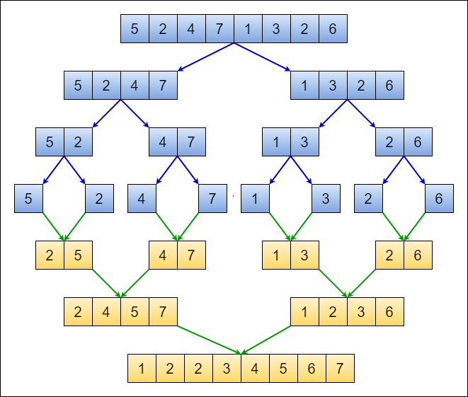

# [to Chinese Version](README_CN.md)

# 1. Linear data structures and nonlinear data structures

[Source: Techvidvan](https://techvidvan.com/tutorials/data-structure-in-java/)

The term data structure refers to a data collection with well-defined operations and behavior or properties. A data
structure is a unique way of **storing or organizing the data in computer memory** so that we can use it effectively.


## 1.1 Linear data structures

1. Linear structures, as the most commonly used data structures, are characterized by a **one-to-one** linear
   relationship between data elements.
2. Linear structures have two different storage structures, namely **sequential storage structure** and **chain storage
   structure**.
3. A linear table with sequential storage is called a **sequence table**, its characteristic is that **the logically
   adjacent data elements are also adjacent in physical order**.
4. A linear table with chained storage is called a **linked list**, where the stored elements are not necessarily
   physically adjacent and the element nodes hold the data elements and the address information of the adjacent
   elements.
5. There are four types of linear data structures: **array**, **queue**, **linked list** and **stack**

## 1.2 non-linear data structures

The non-linear data structure **does not arrange the data in a sequential manner** as in linear data structures.
Non-linear data structures are the multilevel data structure.

Non-linear structures include: **two-dimensional array**, **multi-dimensional array**, **generalized list**, **tree**
and **graph**.

# 2. Sparse Array and Queue

## 2.1 Sparse Array

### 2.1.1 Description of Sparse Array

[Source: techopedia](https://www.techopedia.com/definition/9480/sparse-array#:~:text=A%20sparse%20array%20is%20an,array%20in%20digital%20data%20handling.)

A sparse array is an array of data in which many elements have a value of zero. This is in contrast to a dense array,
where most of the elements have non-zero values or are “full” of numbers. A sparse array may be treated differently than
a dense array in digital data handling.。

How to handle sparse arrays:

1. record the number of rows and columns of the array and the number of different values .
2. Record the row and column of the elements with different values in a small array, thus reducing the size of the
   program.

### 2.1.2 Conversion between two-dimensional array and sparse array

#### Approach two-dimensional array to sparse array

1. Iterate through the original 2-dimensional array to get the number of non-zero data `sum` .
2. Create the sparse array `SparseArr int[sum+1][3]` based on `sum` .
3. Store the non-zero data of the two-dimensional array into the sparse array .

#### Approach sparse array to 2-dimensional array

1. Create the original 2-dimensional array based on the first row of sparse array.
2. Continue to read the next rows of the sparse array and recover the original 2D array.

### 2.1.3 Code

[Conversion between two-dimensional array and sparse array](src/com/yijie/sparsearray/SparseArray.java)

## 2.2 Queue

### 2.2.1 Description of Queue

[Source: Techvidvan](https://techvidvan.com/tutorials/data-structure-in-java/)

Logically, a queue is a **FIFO (First In First Out)** data structure and we can physically implement it **either as an
array or a linked list**. Whatever way we use to implement a queue, **insertions always take place at the “rear” end and
deletions always from the “front” end of the queue**.

### 2.2.2 Queues based on Arrays

1. In queues which are based on arrays , the `maxSize` is the maximum capacity of the queue .
2. Since the output and input of the queue are handled from the front and back respectively, two variables `front`
   and `rear` are needed to record the index of the front and back respectively,
   `front` will change with the data output and `rear` will change with the data input.
3. The process to put data into a queue is called `addQueue`, and the processing of `addQueue` requires two steps:

- Move the rear pointer backwards, `rear+1`; when `front=rear`, the queue is empty
- If the rear pointer `rear` is smaller than the maximum index of the queue `maxSize-1`, deposit the data in the
  position pointed by `rear`, otherwise it cannot be deposited. If `rear == maxSize-1`, the queue is full.


4. Code

[Queues based on Arrays](src/com/yijie/queue/ArrayQueueDemo.java)

### 2.2.3 数组模拟环形队列

- 目前的数组只可使用一次，没有达到复用的效果
- 将这个数组使用算法，改进成一个**环形的队列**，取模: %

#### 使用数组模拟环形序列的思路

1. 对`front`变量的含义做调整:`front`指向队列的第一个元素，也就是说`arr[front]`就是队列的第一个元素，`front`初始值为0。
2. 对`rear`变量的含义做调整:`rear`指向队列最后一个元素的后一个位置，空出空间作为约定，`rear`初始值为0 。
3. 当队列满时，条件为:`(rear+1)%maxSize=front`
4. 当队列为空的条件:`rear = front`
5. 队列中有效数据的个数`(rear+maxSize-front)%maxSize`

#### 代码

[数组模拟环形队列](src/com/yijie/queue/CircleArrayQueueDemo.java)

# 3. 链表

## 3.1 单链表

### 3.1.1 基本介绍

链表是有序的列表，在内存中存储方式如下:  


1. 链表是以节点的方式来存储，是链式存储
2. 每个节点包含data域，next域: 指向下一个节点
3. 链表的各个节点不一定是连续存储
4. 链表分带头节点的链表和不带头节点的链表

### 3.1.2 单链表的创建

1. 先创建一个`head`头节点，作用为表示链表的头
2. 依次添加后续节点到链表最后遍历

### 3.1.3 添加元素到链表指定位置

1. 通过**遍历**以及**辅助变量**`temp`找到新添加节点的位置
2. `新节点.next = temp.next`
3. `temp.next = 新节点`

### 3.1.4 修改链表中节点

1. 通过遍历找到该节点
2. 修改节点信息

### 3.1.5 从单链表中删除一个节点

1. 找到需要删除的节点的前一个节点`temp`
2. `temp.next = temp.next.next`
3. 被删除的节点，将不会有其他引用指向，会被垃圾回收机制回收

### 3.1.6 代码

[单链表](src/com/yijie/linkedlist/SingleLinkedListDemo.java)

## 3.2双向链表

### 3.2.1 基本介绍

单链表缺点分析:

1. 单链表只能从一个方向进行查找，双向链表可以前向或者后向进行查找
2. 单项链表不能自我删除，需要依靠辅助节点，双向可以**自我删除**

### 3.2.2 双向链表的创建及增删改查操作

1. 遍历方法与单链表一直，区别:可以前向，也可后向查找
2. **添加**:默认添加到双向链表最后
1. 找到双向链表的最后节点
2. `temp.next = newHeroNode`
3. `newHeroNode.pre = temp`
3. **修改**的思路及原理与单向链表一致
4. **删除**:
    1. 双向链表可实现自我删除
2. 直接定位到待删除节点`temp`
3. `temp.pre.next = temp.next`
4. `temp.next.pre = temp.pre`

### 3.2.3 代码

[双向链表](src/com/yijie/linkedlist/DoubleLinkedListDemo.java)

## 3.3 单向环形链表

### 3.3.1 单向环形链表的应用: Josephus Problem

Josephu问题:编号为1,2,...,n的n个人围坐一圈，约定编号为k(1<=k<=n)的人从1开始报数，数到m的人出列，m的下一位继续从0开始报数。依次类推，直到所有人出列为止，由此产生一个出列编号的序列。


*示例:

* n=5,共有5人
* k=1,从第一人开始报数
* m=2,数两次
* 出队列顺序:
    * 2=>4=>1=>5=>3

### 3.3.2 单向环形链表的创建及操作

1. **创建**一个单向环形链表
1. 创建第一个节点，让first指针指向该节点，并形成环形
2. 之后每创建一个新节点，就把该节点加入到已有的环形链表即可
2. **遍历**单向环形链表
1. 先让一个辅助指针指向first节点
2. 后通过一个while循环遍历该链表即可(`cur.next first`)

### 3.3.3 代码

[单向环形链表及Josephu Problem](src/com/yijie/linkedlist/JosephuProblem.java)

# 4. 栈

## 4.1 基本介绍 

1. 栈是一个先入先出的有序列表
2. 栈是限制线性表中元素的插入与删除**只能在线性表同一端**进行的一种特殊线性表。允许插入与删除的一段，为变化的一端，称为**栈顶**(Top),另一端为固定的一端，称为**栈底**(Bottom)。
3. 由栈的特性可知，最先放入栈的元素在栈底，最后放入栈的元素在栈顶。而删除元素恰好相反，最后放入的元素最先删除，最先放入的元素最后删除。


## 4.2 栈的应用场景

1. 子程序的调用:在跳往子程序前，会将下个指令的地址存到堆栈中，直到子程序执行完后再将地址取出，以回到原来程序。
2. 处理递归调用:与子程序的调用类似，除了存储下一个指令的地址外，也将参数，区域变量等数据存入堆栈中。
3. 表达式的转换[中缀表达式转后缀表达式]与求职
4. 二叉树的遍历
5. 图形的深度优先(depth-first)搜索法

## 4.3 数组模拟栈

1. 定义一个`top`来表示栈顶，初始化为-1
2. 入栈的操作，当有数据加入到栈时，`top++`;`stack[top] = data`
3. 出栈的操作，`int value = stack[top];top--; return value`
4. [代码](src/com/yijie/stack/ArrayStack.java)

## 4.4 栈实现综合计算器

1. 通过一个`index`值遍历表达式
2. 如果是一个**数字**，就直接入数栈
3. 如果是一个**符号**，分如下情况处理:
    1. 如果当前的符号栈为空，就直接入栈
2. 如果符号符号栈有操作符，就进行比较，**如当前的操作符的优先级小于或者等于栈中的操作符**，就需要从数栈中pop出两个数，从符号栈中pop出一个符号，进行运算。将得到的结果入数栈，后将当前的符号入符号栈。**  
   如果当前操作符的优先级大于栈中的操作符**，就直接入符号栈。
4. 当表达式扫描完毕，就顺序的从数栈和符号栈中pop出相应的数和符号,并运行。
5. 最后在数栈只有一个数字，就是表达式的结果。
6. 代码: [以栈为底的计算器](src/com/yijie/stack/Calculator.java)

## 4.5 栈的前缀，中缀以及后缀表达式（逆波兰表达式）

### 4.5.1 前缀表达式

* 前缀表达式又称波兰表达式，前缀表达式的运算符位于操作数之前
* 示例: (3+4)\*5-6对应的前缀表达式为-*+3456
* 前缀表达式的计算机求值: **从右到左扫描表达式**，遇到数字式时，将数字压入堆栈，遇到运算符时，弹出栈顶两个数，用运算符对他们作相应的运算(栈顶元素和次顶元素)
  ，将结果入栈。重复上述过程直到到大表达式最左端，最后运算出的值即为表达式的结果。

### 4.5.2. 中缀表达式

* 中缀表达式就是最常见的表达式，如(3+4)*5-6
* 人类习惯于中缀表达式，但其不利于计算机操作。因此在计算机运行时会将中缀表达式转换成其他表达式来操作。 一般为后缀表达式。

### 4.5.3. 后缀表达式

* 后缀表达式又称逆波兰表达式，与前缀表达式相似,但运算符位于操作数之后
* 示例: (3+4)\*5-6对应的后缀表达式为: 34+5\*6-
* 后缀表达式的计算机求值: **从左到右**扫描表达式，遇到数字时，将数字压入堆栈，遇到运算符时，弹出栈顶两个数，用运算符对他们左相应的计算(次顶元素和栈顶元素)
  ，并将结果入栈;重复上述过程直至表达式最右端，最后运算得出的值即为表达式的结果。

* 示例:

|   正常表达式    |  逆波兰表达式  |   
|:----------:|:--------:|  
|    a+b     |   ab+    |  
|  a+(b-c)   |  abc-+   |  
| a+(b-c)*d  | abc-d*+  |  
| a+d*(b-c)  | adbc-*+  |  
|   a=1+3    |  a13+=   |

### 4.5.4. 逆波兰计算器:

代码: [逆波兰计算器](src/com/yijie/stack/ReversePolishNotation.java)

### 4.5.5. 中缀表达式转后缀表达式

    1. 初始化两个栈，运算符栈`s1`以及存储中间结果的栈`s2`
    2. 从左到右扫描中缀表达式
    3. 遇到操作数时，将其压入`s2`
    4. 遇到运算符时，比较其与`s1`栈顶运算符的优先级
        1. 如果`s1`为空，或栈顶运算符为左括号"("，则直接将此运算符入栈;
        2. 若优先级比栈顶运算符高，也将运算符压入`s1`
        3. 若优先级不高于栈顶运算符，将`s1`栈顶运算符弹出并压入`s2`中，重复上述比较
    5. 遇到括号时:
        1. 如果左括号"("，则直接压入`s1`
        2. 如果是右括号")"，则依次弹出`s1`栈顶运算符，并压入`s2`，直到遇到左括号为止，丢弃括号
    6. 重复步骤2-5，直到表达式最右端。
    7. 将`s1`剩余运算符依次弹出并压入`s2`
    8. 依次弹出`s2`中元素并输出，结果的逆序为重缀表达式的后缀表达式
    9. 代码: [中缀表达式转后缀表达式](src/com/yijie/stack/ReversePolishNotation.java)

# 5. Recursion

## 5.1 Description of Recursion

Recursion is one of the most important concepts in computer science. Simply speaking, recursion is the process of a
function calling itself. 

In mathematics and computer science, a class of objects or methods exhibits recursive behavior
when it can be defined by two properties:

* **A simple base case (or cases)** — a terminating scenario that does not use recursion to produce an answer 
* **A recursive step** — a set of rules that reduces all successive cases toward the base case.

## 5.2 Recursion Mechanism

1. When a program executes a method, a separate space is opened. (**stack**)
2. the data (local variables) in each space are independent and do not affect each other
3. If a non-primitive data type (e.g. array) is used in a method, the data of that reference type is shared.
4. **recursion must approach the exit condition**, otherwise it will be infinitely recursive and `StackOverFlowError`
   will occur
5. When a method finishes executing, or encounters `return`, it returns, following the principle of who calls the result
   back to whom. Also, when the method finishes executing or returns, the method also finishes executing.

## 5.3 Recursion: Maze


Code: [Maze](src/com/yijie/recursion/Maze.java)

## 5.4 Recursion: Eight Queens Problem（Backtracking）

### 5.4.1 Description of eight queens problem

[Source: Wikipedia](https://en.wikipedia.org/wiki/Eight_queens_puzzle)

The eight queens puzzle is the problem of placing eight chess queens on an 8×8 chessboard so that no two queens threaten each other; thus, a solution requires that no two queens share the same row, column, or diagonal. There are 92 solutions. The problem was first posed in the mid-19th century. In the modern era, it is often used as an example problem for various computer programming techniques.

### 5.4.2 Eight queens problem analysis

1. The first queen is placed in the first column of the first row
2. The second queen is placed in the first column of the second row, determine whether the requirements are met. If not,
   continue to put the second queen in the second column of the second row, the third column... Until the second queen
   is in the eligible position.
3. Place the third queen in the first column of the third row, the second column... Then determine if the condition is
   met, until it is in the eligible position. Repeat the same steps until the eighth queen is in the correct position.
4. When the first correct solution is obtained, backtracking starts when the stack is backed up to the previous stack.
   That is, get all correct solutions when the first queen is in the first column.
5. placing the first queen in the second column of the first row, repeat steps 1 to 4.

### 5.4.3 Code

[Eight Queens Problem](src/com/yijie/recursion/EightQueens.java)

# 6. Sorting Algorithms

## 6.1 Description of Sorting Algorithms

Sorting is the process of arranging items systematically. 
In computer science, sorting algorithms put elements of a list **in a specific order**.

## 6.2 Classification of Sorting Algorithms:

* Internal Sorting: Sorting algorithms that use **main memory exclusively** during the sort are called internal sorting algorithms.
* External Sorting: Sorting algorithms that use **external memory** during the sort

## 6.3 Time Complexity

Time complexity measures the time taken to execute each statement of code in an algorithm.

1. Post-hoc statistical approach: This approach is feasible, but faces two problems:
   * the need to actually run the program
   * The time statistics obtained depends on the computer hardware, software and other environmental factors.
2. ex ante estimation method: the algorithm's time complexity is calculated to evaluate the algorithms

### 6.3.1 Time Complexity T(n)

The time required for an algorithm is directly related to the number of statements executed in the algorithm. 
The more statements are executed in an algorithm, the more time it takes. The number of times a statement is executed in an algorithm is called Time Complexity and is denoted as T(n).

#### Examples:

Calculate the sum of 1 to 100:

* for loop，T(n) = n + 1:

```java
        int total=0;
        int end=100;

        for(i=0;i<end; i++){
        total+=i;
        }
```

* direct calculation，T(n) = 1:

```java
        int total=0;
        int end=100;
        total=(1+end)*end/2
```

3 characteristics:

* constant terms can be ignored
* low order terms can be ignored
* hihher order coefficients can be ignored

### 6.3.2  Big-O notation

1. In general, the time complexity of an algorithm is a function of the input size n, denoted by T(n). If there is some
   auxiliary function f(n) such that n tends to infinity, the limit of T(n)/f(n) is a constant not equal to zero,
   denoted as **T(n)=O(f(n))**, O(f(n)) is the **asymptotic time complexity** of the algorithm, abbreviated as time
   complexity.
2. T(n) can be different, but the time complexity may be the same.
3. The method to calculate the time complexity:
   * **Replace all constants with the constant 1**
   * **Keep only the highest order term**
   * **Remove the coefficients of the highest order term**
4. The common time complexity, from smallest to largest, is listed below. As n increases, the execution efficiency of
   the algorithm decreases as the time complexity increases.
   1. Constant Time Complexity O(1)
   2. Logarithmic Time Complexity O(log2n)
   3. Linear Time Complexity O(n)
   4. Linear Logarithmic Time Complexity O(nlog2n)
   5. Quadratic Time Complexity O(n^2)
   6. Cubic Time Complexity O(n^3)
   7. K-th Order Time ComplexityO(n^k)
   8. Exponential Time Complexity O(2^n)

### 6.3.3 average case and worst case scenarios

1. **Average case scenario** is the running time of the algorithm with **equal probability of occurrence for all input
   instances**.
2. **Worst case analysis** gives the maximum number of basic operations that have to be performed during execution of
   the algorithm. It assumes that the input is in the worst possible state and maximum work has to be done to put things
   right.
3. Whether the average time complexity is consistent with the worst-case time complexity depends on the algorithm.

### 6.3.4 Space complexity

[Source: Wikipedia](https://en.wikipedia.org/wiki/Space_complexity)

1. The space complexity of an algorithm or a computer program is the amount of memory space required to solve an
   instance of the computational problem as a function of characteristics of the input.
2. Similar to time complexity, space complexity is often expressed asymptotically in big O notation, such as O(n), O(
   nlog n), O(2^n), etc., **where n is a characteristic of the input** influencing space complexity.
3. When doing algorithm analysis, the essential discussion is time complexity. **From a user experience perspective, it
   is more about the speed of program execution**. Some caching products (redis, memcache) and algorithms (radix
   sorting) is the traditional exchange of space for time.

## 6.4 Bubble Sort

### 6.4.1 Description of Bubble Sort

[Source: Wikipedia](https://en.wikipedia.org/wiki/Bubble_sort)

Bubble sort, sometimes referred to as sinking sort, is a simple sorting algorithm that repeatedly steps through the list, 
compares adjacent elements and swaps them if they are in the wrong order. The pass through the list is repeated until the list is sorted. 
The algorithm, which is a comparison sort, is named for the way smaller or larger elements "bubble" to the top of the list.

* **Optimization**: an optimization algorithm for bubble sort is to set a flag that indicates that the sequence is ordered 
when no exchange of elements occurs during a traverse to the end.

### 6.4.2 Code

[Bubble Sort](src/com/yijie/sort/BubbleSort.java)

## 6.5 Selection Sort

### 6.5.1 Description of Selection Sort

The algorithm divides the input list into two parts: **a sorted sublist of items** at the front (left) of the list 
and **a sublist of the remaining unsorted items** at the right of the list. 
Initially, the sorted sublist is empty and the unsorted sublist is the entire input list. 
The algorithm proceeds by finding the smallest element in the unsorted sublist, swapping it with the leftmost unsorted element, 
and moving the sublist boundaries one element to the right.


### 6.5.2 Code

[Selection Sort](src/com/yijie/sort/SelectionSort.java)

## 6.6 Insertion Sort

### 6.6.1 Description of Insertion Sort

Insertion sort is a simple sorting algorithm that works similar to the way you sort playing cards in your hands. 
The array is virtually split into **a sorted and an unsorted part**. 
Values from the unsorted part are picked and placed at the correct position in the sorted part.


### 6.6.2 Code

[Insertion Sort](src/com/yijie/sort/InsertionSort.java)

## 6.7 Shell Sort

### 6.7.1 Description of Shell Sort

[Source: Wikipedia](https://en.wikipedia.org/wiki/Shellsort)

Shell sort is an in-place comparison sort. It can be seen as either **a generalization of sorting by exchange (bubble sort)** or **sorting by insertion (insertion sort)**. 
The method starts by sorting pairs of elements far apart from each other, then progressively reducing the gap between elements to be compared. 
By starting with far apart elements, it can move some out-of-place elements into position faster than a simple nearest neighbor exchange. 
Donald Shell published the first version of this sort in 1959. The running time of Shellsort is heavily dependent on the gap sequence it uses. 
For many practical variants, determining their time complexity remains an open problem.

### 6.7.2 Code

[Shell Sort](src/com/yijie/sort/ShellSort.java)

## 6.8 Quick Sort

### 6.8.1 Description of Quick Sort

[Source: Wikipedia](https://en.wikipedia.org/wiki/Quicksort)

Quicksort is a **divide-and-conquer algorithm**. 
It works by selecting a 'pivot' element from the array and partitioning the other elements into two sub-arrays, 
according to whether they are less than or greater than the pivot. 
For this reason, it is sometimes called **partition-exchange sort**. 
The sub-arrays are then sorted recursively. 
This can be done in-place, requiring small additional amounts of memory to perform the sorting.


### 6.8.2 Code

[Quick Sort](src/com/yijie/sort/QuickSort.java)

## 6.9 Merge Sort

### 6.9.1 Description of Quick Sort

[Source: Wikipedia](https://en.wikipedia.org/wiki/Merge_sort)

Conceptually, a merge sort works as follows:

* Divide the unsorted list into n sublists, each containing one element (a list of one element is considered sorted).
* Repeatedly merge sublists to produce new sorted sublists until there is only one sublist remaining. This will be the
  sorted list.



### 6.9.2 Code

[Merge Sort](src/com/yijie/sort/MergeSort.java)

## 6.10 Radix Sort

### 6.10.1 Description of Radix Sort

[Source: Wikipedia](https://en.wikipedia.org/wiki/Radix_sort)

1. In computer science, radix sort is a **non-comparative sorting algorithm**. It avoids comparison by creating and
   distributing elements into buckets according to their radix.
2. For elements with more than one significant digit, this bucketing process is repeated for each digit, while
   preserving the ordering of the prior step, until all digits have been considered.
3. radix sort has also been called bucket sort and digital sort.


### 6.10.2 Code

[Radix Sort](src/com/yijie/sort/RadixSort.java)

## 6.11 Time Complexities Cheat Sheet

[Source: Wikipedia](https://en.wikipedia.org/wiki/Radix_sort)


# 7. Searching Algorithms

## 7.1 linear Search

### 7.1.1 Description of linear Search

[Source: Wikipedia](https://en.wikipedia.org/wiki/Linear_search)

A linear search or sequential search is a method for finding an element within a list. It sequentially checks each
element of the list until a match is found or the whole list has been searched.

### 7.1.2 Code

[linear search](src/com/yijie/search/LinearSearch.java)

## 7.2 Binary Search

### 7.2.1 Description of Binary Search

the binary search approach:

1. First determine the index of the middle value of the array: `mid = (left + right) / 2`
2. compare the value to be found `findVal` with `arr[mid]`
    * `findVal > arr[mid]` recursion to the right
    * `findVal < arr[mid]` recursion to the left
    * `findVal == arr[mid]` value found, return
3. after the recursion for the whole array, if `findVal` is still not found, end (`left > right`)

### 7.2.2 Code

[binary search](src/com/yijie/search/BinarySearch.java)

# 8. Hash Table

## 8.1 Description of Hash Table

[Source: Wikipedia](https://en.wikipedia.org/wiki/Hash_table)

In computing, a hash table (hash map) is a data structure that implements an associative array abstract data type, a
structure that can map keys to values. A hash table uses a hash function to compute an index, also called a hash code,
into an array of buckets or slots, from which the desired value can be found. During lookup, the key is hashed and the
resulting hash indicates where the corresponding value is stored.

### 8.1.1 Hashing

[Source: Educative](https://www.educative.io/courses/data-structures-coding-interviews-java/q2pWP84GWmG)

Hashing is a process used to uniquely identify objects and store each object at some pre-calculated unique index called
its key. So the object is stored in the form of **a key-value pair**, and the collection of such items is called
“Dictionary”. Each object can be searched using that key in **O(1)**.

### 8.1.2 Hash Table

The major target of Hash Tables is to minimize the searching time of any sort of data that needs to be fetched.

Hash Tables are generally implemented using **Arrays**, as they are the only data structures that provide access to
elements in constant O(1) time.

## 8.2 Code

[Hash Table](src/com/yijie/hashtable/HashTableDemo.java)

# 9. Tree

## 9.1 Binary tree

[Source: Wikipedia](https://en.wikipedia.org/wiki/Binary_tree)

In computer science, a binary tree is a tree data structure in which each node has at most two children, which are
referred to as the left child and the right child.

### 9.1.1 Analysis of array storage

- Pro: fast accessing of elements by index. For sorted arrays, binary search can be used to increase the speed.
- contra: inefficient when inserting values, the whole array needs to be moved

### 9.1.2 Analysis of linked list storage

- Pro: optimize the array storage to some extent. efficient insertion and deletion compared to array storage
- contra: inefficient when searching values, which needs a traversal from the head node

### 9.1.3 Analysis of tree storage

Improve the efficiency of data storage and reading, such as binary trees, which can ensure the speed of data retrieval,
but also ensure the speed of data insertion, deletion and modification.

## 9.2 Components and Terminologies

[Source: Educative](https://www.educative.io/courses/data-structures-coding-interviews-java/qVMzgL0nZAk)

- **Nodes**: Hold data
- **Root**: The uppermost node of a tree
- **Parent Node**: A node which is connected to one or more nodes on the lower level (Child Nodes).
- **Child Node**: A node which is linked to an upper node (Parent Node)
- **Sibling Node**: Nodes that have the same Parent Node
- **Leaf Node**: A node that doesn’t have any Child Node
- **Sub-tree**: A subtree is a portion of a tree that can be viewed as a complete tree on its own. Any node in a tree,
  together with all the connected nodes below it, comprise a subtree of the original tree.
- **Degree**: The degree of a node refers to the total number of sub-trees of a node
- **Depth**: The number of connections (edges) from the root to a node is known as the depth of that node.
- **Level**: (Depth Of Node) + 1

## 9.3 Pre-Order, In-Order and Post-Order Traversal in Binary Trees

1. Create the binary tree
2. **Pre-Order Traversal**
   1. Visit the current node and display its data.
   2. Traverse the left sub-tree of currentNode, recursively using the PreOrder() function.
   3. Traverse the right sub-tree of currentNode, recursively using the PreOrder() function.
3. **In-Order Traversal**
   1. Traverse the left sub-tree of currentNode, recursively using the InOrder() function.
   2. Visit the current node and read.
   3. Traverse the right sub-tree of currentNode, recursively using the In-Order() function.
4. **Post-Order Traversal**
   1. Traverse the left sub-tree of currentNode, recursively using PostOrder() function.
   2. Traverse the right sub-tree of currentNode, recursively using PostOrder() function.
   3. Visit current node and print its value.

## 9.4 Pre-Order, In-Order and Post-Order Search in Binary Trees

1. **Pre-Order Search**
   1. determine whether the value of the current node is equal to the value to be found, **if equal, return**, if not:
   2. if the left child node is not empty, recursive pre-order search, **if found, return**, if not:
   3. if the right child node is not empty, recursive pre-order search
2. **In-Order Search**
   1. if the left child node is not empty, recursive in-order search, **if found, return**, if not:
   2. determine whether the value of the current node is equal to the value to be found, **if equal, return**, if not:
   3. if the right child node is not empty, recursive in-order search
3. **Post-Order Search**
   1. if the left child node is not empty, recursive in-order search, **if found, return**, if not:
   2. if the right child node is not empty, recursive in-order search, **if found, return**, if not:
   3. determine whether the value of the current node is equal to the value to be found, **if equal, return**, if not
      return `null`

## 9.5 Deletion

### 9.5.1 Requirements

1. if the node to be deleted is a leaf node, just delete the node
2. if the node to be deleted is a non-leaf node, delete the whole sub-tree

### 9.5.1 Approach

Consider: If the tree is empty, there is only a `root` node and set it to be null

1. Since the binary tree is unidirectional, we should **determine whether the children of the current node need to be
   deleted**, rather than determining whether the current node is a node to be deleted.
2. If the left child of the current node is not empty and is the node to be deleted, `this.left = null`, return
3. if the right child of the current node are not empty and is the node is to be deleted, `this.right = null`, return
4. If no nodes have been deleted during the second and the third step, then recursive deletion to the left subtree
5. If the fourth step does not delete the node, recursive deletion to the right subtree

## 9.6 Code

[Binary tree](src/com/yijie/tree/BinaryTreeDemo.java)